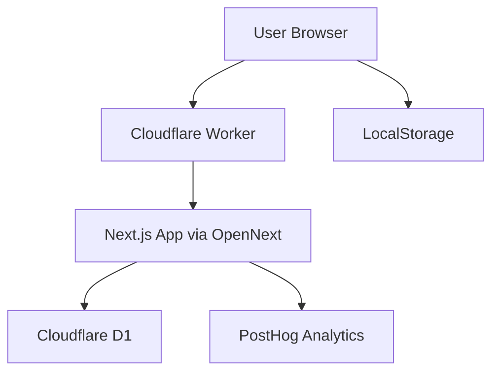

# SplitSimple Infrastructure

SplitSimple now runs its share-link backend on Cloudflare Workers with Cloudflare D1. The app keeps local browser autosave for drafts, while shared bills are persisted in D1 through the existing `/api/bills/:id` route contract.

## Architecture


```mermaid
graph TB
    A[User Browser] --> B[Cloudflare Worker]
    B --> C[Next.js App via OpenNext]
    C --> D[Cloudflare D1]
    C --> E[PostHog Analytics]
    A --> F[LocalStorage]
```

## Core Pieces

| Component | Technology | Purpose |
| --- | --- | --- |
| Frontend | Next.js 16 + React 19.2 | Bill splitting UI |
| Runtime | Cloudflare Workers via OpenNext | Next.js app and API routes |
| Database | Cloudflare D1 | Shared bill storage |
| Local state | LocalStorage | Draft persistence on device |
| Analytics | PostHog | Product analytics |

## Local Development

```bash
pnpm install
cp .dev.vars.example .dev.vars
pnpm db:migrations:apply:local
pnpm dev
```

`pnpm dev` uses the normal Next.js development server. The `initOpenNextCloudflareForDev()` call in `next.config.mjs` exposes local Cloudflare binding simulations to server code.

Production builds currently use `next build --webpack`. Next.js 16 defaults to Turbopack, but the Cloudflare OpenNext bundle path currently handles this app cleanly with Webpack.

For a closer production match, use:

```bash
pnpm preview
```

## D1 Setup

Create the production database:

```bash
pnpm wrangler login
pnpm wrangler d1 create splitsimple
```

Copy the returned `database_id` into `wrangler.jsonc`, replacing `REPLACE_WITH_D1_DATABASE_ID`.

Apply the schema:

```bash
pnpm db:migrations:apply:remote
```

## Deployment

```bash
pnpm deploy
```

The deploy command builds the Next.js app with `@opennextjs/cloudflare` and deploys the Worker using `wrangler.jsonc`.

## Data Model

`migrations/0001_create_bills.sql` creates a single `bills` table. The canonical bill is stored as JSON so the app can evolve the bill schema without a migration for every UI-level field. Query-facing metadata is duplicated into columns:

- `id`
- `title`
- `status`
- `created_at`
- `last_modified`
- `expires_at`
- `access_count`
- `last_accessed`
- `size_bytes`

D1 does not provide Redis-style TTL, so expiration is enforced by filtering `expires_at` in the bill store. Reads that increment access also refresh the six-month expiry window, matching the previous sliding-expiration behavior.

## Operational Notes

- Remote D1 migrations should be applied before deploying code that depends on them.
- `pnpm preview` is the best local smoke test because it runs in the Workers runtime.
- `ADMIN_PASSWORD_HASH` remains optional for admin routes, depending on how the admin panel is used.
- OCR provider keys are optional; paste-text receipt import still works without them.
