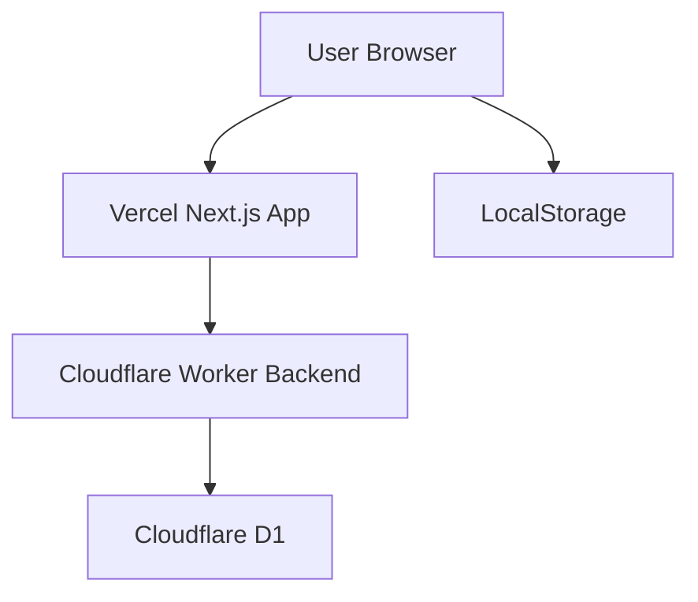

# SplitSimple Infrastructure

SplitSimple uses a split deployment:

- Vercel hosts the Next.js app
- Cloudflare hosts the shared-bill backend
- Cloudflare D1 stores shared bills
- Browser local storage stores draft edits

## Request Flow


```mermaid
graph TB
    A[User Browser] --> B[Vercel Next.js App]
    B --> C[Cloudflare Worker Backend]
    C --> D[Cloudflare D1]
    A --> E[LocalStorage]
```

## Runtime Boundaries

| Layer | Runs on | Responsibility |
| --- | --- | --- |
| Frontend | Vercel | UI, auth, local editing, API proxying |
| Backend | Cloudflare Workers | Shared bill API and admin bill management |
| Database | Cloudflare D1 | Persistent shared bills |

## Local Development

Run the frontend and backend separately:

```bash
pnpm dev
pnpm backend:dev
```

Apply backend schema changes with:

```bash
pnpm backend:db:migrations:apply:local
```

## Environment

Frontend:

- `ADMIN_PASSWORD`
- `CLOUDFLARE_BACKEND_URL`
- `BACKEND_SHARED_SECRET`

Backend:

- `BACKEND_SHARED_SECRET`
- D1 binding `DB`

## Deployment

1. Deploy the Cloudflare backend and apply migrations.
2. Set the backend URL and shared secret in Vercel.
3. Deploy the Next.js app on Vercel.

## Notes

- Shared bills are no longer stored in Redis.
- The browser never talks to D1 directly.
- The Vercel app calls the backend through its own API routes, which keeps the Cloudflare URL and secret out of client code.
